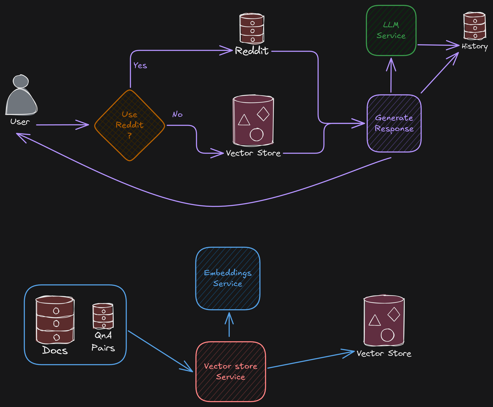

# Godot Docs and Forums Chatbot

This repo is the application base for RAG based Chatbot for the Godot Docs and Forums.

## Architecture Diagram



## Example API POST request

1. `/query`:
   POST: `http://localhost:8000/query`
   ```json
   {
     "query": "How do I create a 2D tileset?",
     "session_id": "128738126738",
     "state": {
       "model_name": "qwen-qwq-32b",
       "category": null,
       "sub_category": null,
       "temperature": 0.7,
       "top_k": 10,
       "memory_service": "astradb"
     }
   }
   ```
