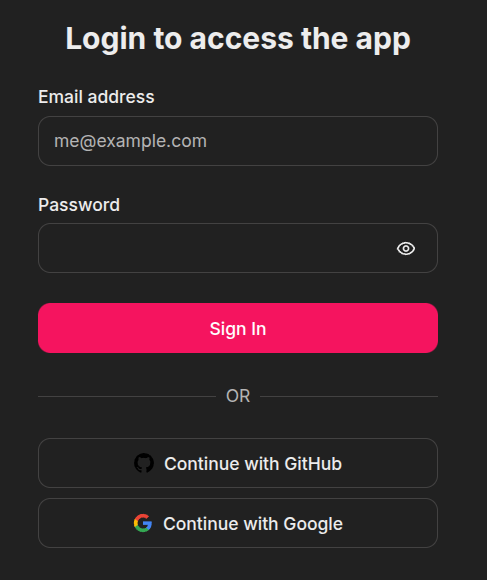
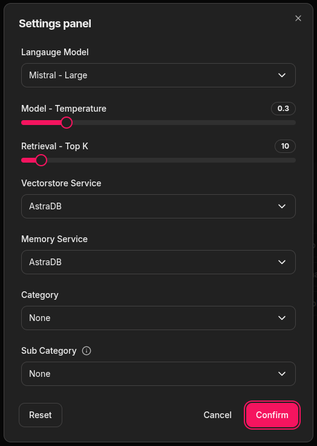

# Godot Docs and Forums Chatbot

This repo is the application base for RAG based Chatbot for the Godot Docs and Forums.

## Usage Guide

### Login Page

The login page is used to authenticate the user and access the application. The user can login using either their Github account or Google account. 

### Settings Panel

The settings panel is used to change/select Language model that you want to use for generating the response, setting the temperature for applying randomness in response, the category and sub category from the docs to refer for the response etc. The app supports LLMs services from Cohere, Gemini, Groq and Mistral. The app also uses two different services for storing chat histories. A detailed settings panel usage has been explained below:

- Language Model:
- Model - Temperature:
- Retrieval - Top K:
- Vectorstore Service:
- Memory Service:
- Category:
- Sub Category:

#### Category - Sub Category Pairing
